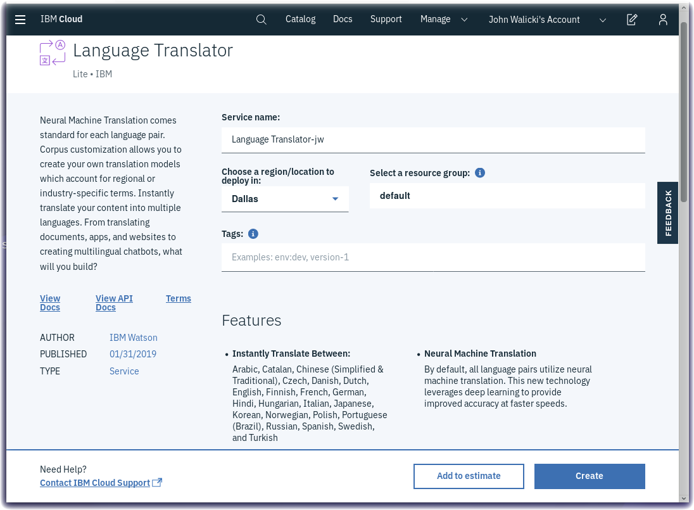
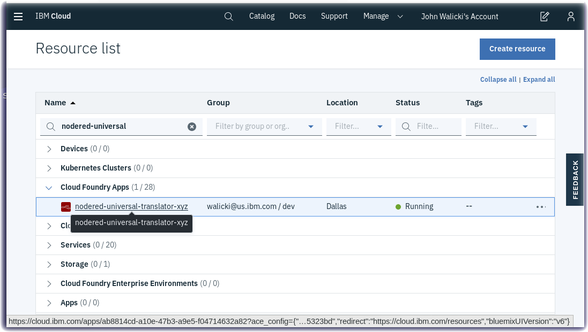
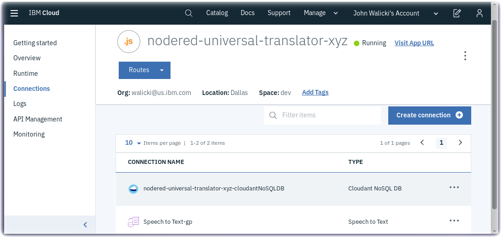
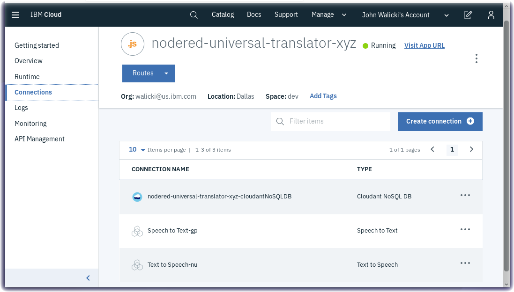

# NodeRED-Starter-Universal-Translator
Create an IBM Cloud Node-RED Starter Kit and Build a Universal Translator

In this tutorial you will learn how to create a Node-RED Starter application that can be used to connect Watson AI services Speech to Text, Language Translator and Text to Speech to create a spoken Universal Translator. The **Node-RED Starter** is designed with pre-assembled services that work together.  The Node-RED Starter includes a Node-RED Node.js web server and Cloudant database to store the Node-RED flows.

## Learning objectives

After completing this tutorial you will be able to:

- Create an Node-RED Starter Kit application running in IBM Cloud
- Create service instances of Watson Speech to Text, Watson Text to Speech and Watson Language Translator
- Connect these service instances to your Node-RED Starter application
- Launch the Node-RED Starter application
- Configure the Node-RED visual programming editor
- Install additional Node-RED nodes
- Create a flow that translates speech to a transcript
- Create a flow that converts a transcript into an audio file and played.
- Connect these flows using language translation to speak in one language and hear the translations in another

## Prerequisites
This tutorial can be completed using an IBM Cloud Lite account.

* Create an [IBM Cloud account](https://cloud.ibm.com/registration)
* Log into [IBM Cloud](https://cloud.ibm.com/login)

## Estimated time

You can complete this task in no more than 15 minutes.

## Step 1 - Create a Node-RED Starter Application

Follow these steps to create a Node-RED Starter application in IBM Cloud.

- Create an [IBM Cloud account](https://cloud.ibm.com/registration) and log into [IBM Cloud](https://cloud.ibm.com/login)
- Click on the [Catalog](https://cloud.ibm.com/catalog/) (1) and search for **node-red** (2)
- Under	**Starter Kits** (3) click on [**Node-RED Starter**](https://cloud.ibm.com/catalog/starters/node-red-starter) (4)

- Enter a **unique name** for your application (5). This name will be part of the **application URL** (6)
  - *Note:* In case the name is not unique you will receive an error message and can enter another name.
- The **Region** (7), **Organization** (8) and **Space** (9) will be prepopulated with valid options for your IBM Cloud account.  If you have a Lite account then accept the defaults.  If you have a trial or paid account, or belong to additional organizations, then you may choose to deploy in to any region, organization and space available to you.
- The Node-RED Starter application can be provisioned in the IBM Cloud *Lite* plan (10)
- Click on the **Create** button (11)

- The Node-RED Starter application will be provisioned in the IBM Cloud region that was specified. This is called staging an application. It can take a few minutes for this process to complete.
- You do not need to wait for the application to provision and start. Proceed to the next step.

## Step 2 - Create Watson AI Service Instances

There are powerful Watson AI microservices that can be added to your application as APIs. These services are accessible through instances that you can manage through credentials.  Instead of copy / pasting credential keys, this tutorial demonstrates how to create and bind these microservices to your Cloud Foundry application.  The Node-RED nodes for these services will be easy to configure.

Three Watson AI services, all available in the IBM Cloud Lite tier, are needed to build a Universal Translator.
- Watson Speech to Text
- Watson Text to Speech
- Watson Language Translator

Return to the IBM Cloud Catalog, search for [**speech**](https://cloud.ibm.com/catalog?search=speech&category=ai), navigate to the AI category.

- Click on [**Speech to Text**](https://cloud.ibm.com/catalog/services/speech-to-text) and press the **Create** button.
 
- Return to the AI category in the IBM Cloud Catalog and click on [**Text to Speech**](https://cloud.ibm.com/catalog/services/text-to-speech) and press the **Create** button.
 
- Return to the IBM Cloud Catalog, search for [**translator**](https://cloud.ibm.com/catalog?search=translator&category=ai), navigate to the AI category.

- Click on [**Language Translator**](https://cloud.ibm.com/catalog/services/language-translator) and press the **Create** button.
 

## Step 3 - Connect the Watson AI Services to Node-RED Starter Application

In this step, the tutorial demonstrates how to connect the newly created Watson AI services to your Node-RED Starter application.

- Return to the [IBM Cloud Dashboard](https://cloud.ibm.com/resources?groups=cf-application) and navigate to the Cloud Foundry Apps section.

- Click on your nodered-universal-translator CF application.  The **Applications Details** will open.
 
- Click on **Connections** in the left navigation menu.
- Click on **Create connection** button.
 
- Search for the Watson Speech services you created in the prior step, hover over **Speech to Text** and press the **Connect** button.
 
- Press the **Connect** button to auto generate the binding credentials.
 
- **DO NOT RESTAGE** the application yet.  Press the **Cancel** button. After all three AI service instances are connected, the application can be restaged just once.
 
- Press **Create Connection** button again.
 
- Search for the **speech** services, hover over the **Text to Speech** service, and press the **Connect** button.
 
- Press the **Connect** button to auto-generate the IAM credentials.
- Remember to **NOT** press the Restage button.
- For the third time, press the **Create connection** button.
 
- Search for the **language translator** service and hover over the Language Translator service, and press the **Connect** button.
 
- Press the **Connect** button to auto-generate the IAM credentials.
- Now, finally, press the **Restage** button.
 
- The Cloud Foundry application will now restage and restart.

## Step 4 - Launch the Node-RED Starter Application

- Once the Green **Running** icon appears, click the **View App URL** link.
  

## Step 5 - Open the Node-RED visual programming editor
A new browser tab will open to the Node-RED start page.  Node-RED is an open-source Node.js application that provides a visual programming editor that makes it easy to wire together flows.

Several panels will help you set up the Node-RED Starter application.

* Welcome to Node-RED. Click the **Next** button to proceed. Step 1 of 5

* Secure your Node-RED editor by setting a username / password.  Remember your username / password. Click the **Next** button to proceed. Step 2 of 5

* You can add more nodes. Step 3 of 5

* If you forget, you can reset the username / password in the Cloudant DB or by setting IBM Cloud environment variables.  Click the **Finish** button to proceed. Step 4 of 5

* Click the **Go to your Node-RED flow editor** button to launch the Node-RED flow editor. Step 4 of 5

* Click on the Person icon in the upper right corner and **Sign in** with your new username and password credentials.

* The **Node-RED Visual Programming Editor** will open with a default flow. On the left side is a **palette of nodes** that you can drag onto the flow. You can **wire nodes together** to create a program.

## Step 6 - Install Additional Node-RED Nodes

The Universal Translator needs a microphone to record your message and the ability to play audio of the translation.  Luckily, there are nodes that can be added to the Node-RED palette that add these capabilities.

- Click on the Node-RED Menu and select **Manage palette**
 
- Turn to the **Install** tab
- Search for **browser-utils**, find the *node-red-contrib-browser-utils* node and press the **Install** button.
 
- Search for **play-audio**, find the *node-red-contrib-play-audio* node and press the **Install** button.
 

## Step 7 - Build a Speech to Text Flow

Node-RED allows you to drag and drop Nodes from the left palette onto your flow canvas and wire them together to create programs.

- Grab a *microphone* node and drag it to your flow.
- Grab a *Speech to Text* node and drag it to your flow.  Double-click on the node and select US English.
- Grag a *Debug* node and drag it to your flow.
- Double-click on the Debug node and have it output msg.transcription
- Wire the nodes together as shown in the screenshot.
- Press the red **Deploy** button.
- Press the *microphone* tab and allow your browser access to the microphone on the laptop.
- Record a message!

## Step 8 - Build a Text to Speech Flow

- Grab an *Inject* node and drag it to your flow.
- Double-click on the Inject node and change the payload type to a string and type a message.
 
- Grab a *Text to Speech* node and drag it to your flow.  Double-click on it and select US English.
- Grab a *Change* node and drag it to your flow.
The returned audio transcription from the Text to Speech node will be returned as a raw buffer containing the audio on msg.speech.  The play-audio node expects the buffer to be passed in on msg.payload so the Change node will reassign the values. Double-click on the Change node and assign the msg.payload to msg.speech
 
- Grab a *play-audio* node and drag ito to your flow.
- Wire the nodes together as shown in the screenshot.
- Press the red **Deploy** button.
- Press the *inject* tab
- The audio of the message will play

## Step 9 - Build a Language Translator flow

Our Universal Translator will use the recorded transcript as the input to the language translator node and then send the foreign language to the Text to Speech node.

- Grab another *Change* node and drag it to your flow.
- Double-click on the  node and assign msg.payload to msg.transcription
 
- Grab a *language translator* node and drag it to your flow.
- Double-click on the Language Translator node and select English as the Source and Spanish as the Target.
 
- Grab a debug node and drag it to your flow.
- Double-click on the Text to Speech node and change the language to Spanish and select a voice.
 
- Wire the nodes together as shown in the screenshot.
 
- Press the red **Deploy** button.
- Press the *microphone* tab and allow your browser access to the microphone on the laptop.
- Record a message!

## Congratulations - You've built a Universal Translation

Experiment with translations between various languages

## Get the Code

If you want to import the solution, get the [code here](flows/NodeRED-UniversalTranslator-flow.json)

## Finished
Congratulations!  You have completed the creation of a Node-RED Starter application in IBM Cloud.
